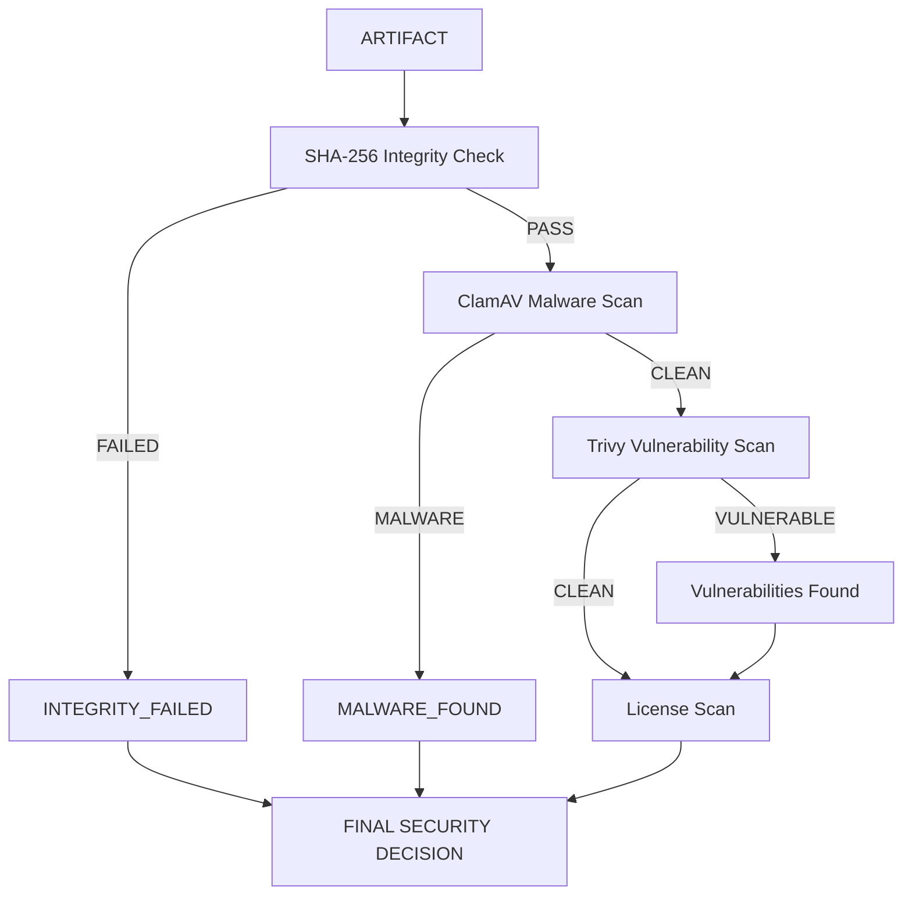
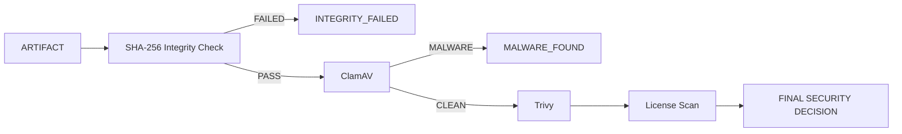
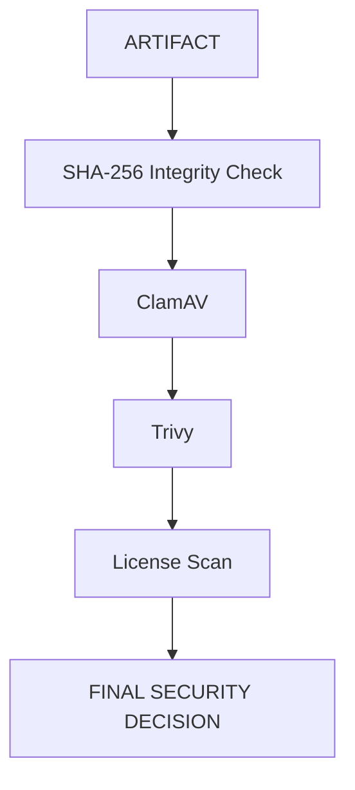

## Architecture

```mermaid
flowchart TD
    A[ARTIFACT] --> B[SHA-256 Integrity Check]

    B -->|FAILED| C[INTEGRITY_FAILED]
    B -->|PASS| D[ClamAV Malware Scan]

    D -->|MALWARE| E[MALWARE_FOUND]
    D -->|CLEAN| F[Trivy Vulnerability Scan]

    F -->|CLEAN| G[License Scan]
    F -->|VULNERABLE| H[Vulnerabilities Found]

    H --> G

    G --> I[FINAL SECURITY DECISION]

    C --> I
    E --> I
```

## Left → Right Layout

```mermaid
flowchart LR
    A[ARTIFACT] --> B[SHA-256 Integrity Check]

    B -->|FAILED| C[INTEGRITY_FAILED]
    B -->|PASS| D[ClamAV]

    D -->|MALWARE| E[MALWARE_FOUND]
    D -->|CLEAN| F[Trivy]

    F --> G[License Scan]
    G --> H[FINAL SECURITY DECISION]
```

## Security Pipeline 

```mermaid
flowchart TD
    A[ARTIFACT]
    B[SHA-256 Integrity Check]
    C[ClamAV]
    D[Trivy]
    E[License Scan]
    F[FINAL SECURITY DECISION]

    A --> B
    B --> C
    C --> D
    D --> E
    E --> F
```
